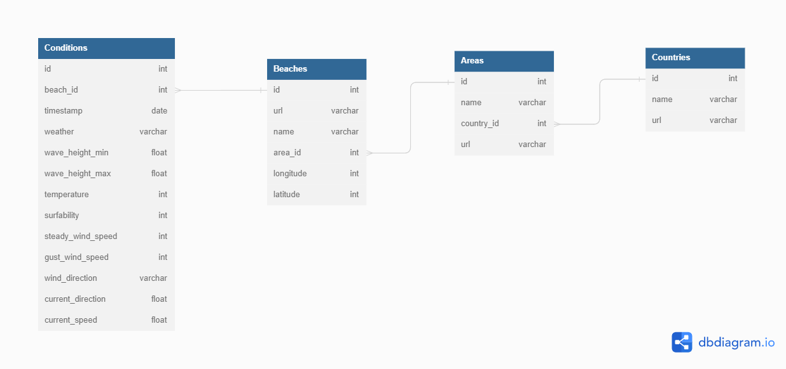

# Magicseeweed.com

## Description

This is a web scraping project that extracts Surf Forecast data from the website [MagicSeaWeed.com](https://magicseaweed.com/) and the API [StormGlass.io](https://stormglass.io/).
The project aims to collect as much detail as possible for each data point, including wave height, wind speed (gust and steady speed), temperature and current.

## Data Source

The data source used in this project come from Magicseeweed.com and Stormglass.io.

Magicseaweed.com is a website that provides surf forecasting and related information for beaches around the world.
It offers up-to-date data on wave height, swell direction, wind speed, tide times, and other relevant metrics to help surfers, windsurfers, and kitesurfers plan their sessions.

Stormglass.io is a global weather API that focused on weather forecasts & historical data from the world’s most trusted meteorological institutions.

## Requirements

Please run the following in order to install all the required modules that the code to run :

```pip install requirements.txt```

## How to Run

* Install the required packages running the commands above (Requirements). 
* In order for the code to run, you need to insert the absolute path that contains your own API key from Stormglass.io in the json file.
* Run the main Python script using python main.py with the following options passed as arguments :
  - `-mode` : whether should the data be print in the stdout or store in a SQL database (more information about this option below)
  - `-country` : the country from which you want to extract the data : Hawaii, France or Israel. You can also extract all of them with choosing the "ALL" option.
EXAMPLE : `main.py -mode database -country Hawaii` will print to the stdout all the data from every beach in Hawaii.

* Connect to your sql local server
  - In the conf_sql.json: `"password": "*****"` input your own password
  - In the conf_sql.json: `"user": "*****"` input your own username
  

## Project Structure

* main.py: The main script that initiates the web scraping process. 
* one_beach_scrapping.py: Contains the functions for retrieving the data of interest (detailed below) for one url page. 
* url_extraction.py: Contains the functions for getting all beaches urls using Selenium.
* database.py : contains the function related to SQL, i.e. create database and table and inserting the values.
* api.py : contains the function that query data from Stormglass.io API.
* conf.json : the configuration file read by all the .py
* conf_sql.json : the configuration file read for the sql queries.

## Database Structure

If you choose the `-mode database` option while running the script then, it will create a database named MagicSeaWeed.
The tables are constructed in the following manner:


## Contributors

<a href="https://www.linkedin.com/in/claudia-palierne-0188631b9/">
  
</a>
Claudia Palierne 


<a href="https://www.linkedin.com/in/mathias-kammoun/">
  
</a>
Mathias Kammoun 

## Usage

The code can be run from command line or from any IDE like PyCharm.

## Results

Milestone 3 : For every beach in a given country coast and for every 3 hours every day of the week past the execution, the code prints/store the following information:
* weather
* temperature (in Celsius)
* swell : min and maximum of the wave height
* surfability (wave quality indicator)
* steady speed wind (in KpH)
* gust speed wind  (in KpH)
* wind direction : indicators for wind direction and rotation
* current speed in meters per second
* current direction in degree
* latitude and longitude

## Future Work

The next steps of this project will aim to perform an analysis :
Given the past and current weather data, outputs the best spot in the country to go surfing.

## References

* MagicSeaWeed : 
[msw.com](https://magicseaweed.com/)

* Selenium :
[medium.com](https://medium.com/pythoneers/web-scraping-using-selenium-python-6c511258ab50#:~:text=It%20is%20the%20process%20of,can%20scrape%20dynamic%20web%20easily)
[zenrows](https://www.zenrows.com/blog/scraping-javascript-rendered-web-pages#the-disadvantage-of-using-selenium)

* BeautifulSoup and HTML:
[realpython.com](https://realpython.com/beautiful-soup-web-scraper-python/)

* Stormglass.io :
[stromglass.io](https://stormglass.io/)

